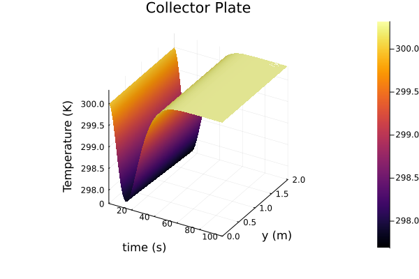
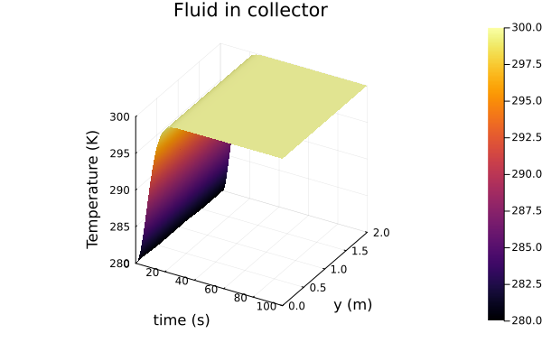
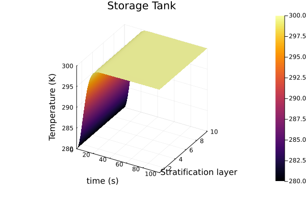

# Rudimentary Solar Water Heating System Simulation
## Running this repo
The only requirement is [julia](https://julialang.org/), preferably 1.9.
- Clone this repo
- Start a Julia REPL in the root directory of the repo
```shell
julia --project=.
```
- Press `]` to enter Pkg mode. The REPL prompt should look like so
```
(Simulation) pkg>
```
- Instantiate the package. This step will download dependencies and take some time. Most of the heavier dependencies come from the two SciML packages. Note that solvers from this package were only used for testing the model, not for the calculating solution used for the plots.
```
(Simulation) pkg> instantiate
```
- Precompile the package. Again, this should take 5-ish minutes. Play a match of Blitz Chess maybe.
```
using Simulation
```
- Hit backspace to return to the regular REPL, run the tests and, generate plots
```julia
julia> include("test/runtests.jl")
```

## Assumptions and Simplifications
We make the following assumptions and simplifications
- Flat plate collector with parallel riser tubes
- Temperature variations along the width of the solar collector (i.e. perpendicular to fluid flow direction) are not modelled, assume uniform mean temperature along with.
- Single phase regime -- the fluid does not undergo phase change
- Changes in specific heat capacity with temperature are negligible for all materials in the operating range
- Fixed ambient temperature, wind speed (i.e. fixed convection heat transfer coefficients), sky temperature, and solar irradiation
- Working fluid is incompressible, mass flow rate is constant throughout the system
- Heat exchanges occur only at the collector and storage tank, no heat transfer at pipes or pump
- The work done by the pump is completely balanced by e.g. the changes in potential energy in the storage tank and riser tubes, so it does not appear in the balance equations
- Radial temperature of the fluid is not modelled - assume an overall mean temperature across the cross section

## Model Parameters
```julia
@kwdef struct SWHSModel{T}
    Ns::Int= 10       # stratifications count for tank
    Nc::Int= 100      # number of points in the discretized mesh of collector    
    ρp::T  = 8.0e3    # density of plate
    ρf::T  = 1.0e3    # working fluid density
    ρe::T  = 1.5e3    # effective density (tank + wokring fluid)
    δ::T   = 0.1      # plate thickness
    W::T   = 1.0      # plate width
    L::T   = 2.0      # plate length
    H::T   = 10.0     # height of tank
    ΔH::T  = H/Ns     # height of each stratified layer
    Δy::T  = L/Nc
    dt::T  = 5.0      # tank diameter         
    dr::T  = 0.1      # riser pipe diameter
    dd::T  = dr       # down comer pipe diameter    
    kp::T  = 50.0     # thermal conductivity of plate
    Cpp::T = 450.0    # specific heat capacity of plate
    Cpf::T = 4.2e3    # specific heat capacity of working fluid
    Cpe::T = 5000.0   # effective specific heat of tank + working fluid
    S::T   = 800.0    # radiation flux
    hpf::T = 1000.0   # heat transfer coefficient (plate and working fluid)
    hpa::T = 100.0    # heat transfer coefficient (plate and atmosphere)
    hra::T = 100.0    # heat transfer coefficient (riser pipe and ambient)
    hda::T = hra      # heat transfer coefficient (down pipe and ambient)
    hta::T = 500.0    # loss coefficient (storage tank)    
    Ta::T  = 300.0    # ambient temperature
    T∞::T  = 295.0    # sky temperature
    α::T   = 5.5e-8   # radiation coefficient
    Af::T  = W*L*0.2  # transverse cross section area pipes in collector
    mdot::T = 0.5 * Af * ρf  # mass flow rate (assuming 0.5m per s in collector pipes
    A::T   = π*dt*ΔH  # ambient contact area per stratified layer
    V::T   = ΔH*π*(dt^2)/4  # tank volume per stratified layer
    ρCl::T = 1.0e3    
    mCr::T = 1.0e3   
    mCd::T = mCr
    ...
end
```
## Subsystems
### Collector
We consider a flat plate collector with parallel riser tubes modelled as an absorber plate transfering heat to the fluid in the risers. This model is based on the work of [4]. Heat transfer between plate and fluid modelled as convection using Newton's law of cooling [1].
#### Plate
We have the following processes
- Solar radiation, $\propto T_p^4 - T_{\text{sky}}^4$ (Stefan-Boltzmann law)
- Convective transfer to fluid, $\propto  T_p - T_f$ (Newton's law of cooling)
- Convective loss to atmosphere, $\propto T_p - T_a$ (Newton's law of cooling)

$$\rho_p \delta C_{pp}\frac{\partial T_p}{\partial t} = S + \delta k_p \frac{\partial^2 T_p}{\partial y^2}- h_{pf}(T_p - T_f) - h_{pa}(T_p - T_a) - \alpha(T_p^4 - T_{\text{sky}}^4)$$

where $\alpha$ is a constant that includes the Stefan-Boltzmann constant, emissivities etc. This equation equation models heat transfer rate per unit area of the collector. Since we assume no dynamics along the width of the collector, we multiply the equation by the width $W$ of the collector to get the effective dynamics along the length of the conductor ($T_p = T_p(t, y)$). 

$$W\rho_p \delta C_{pp}\frac{\partial T_p}{\partial t} = WS - Wh_{pf}(T_p - T_f) - Wh_{pa}(T_p - T_a) - W\alpha(T_p^4 - T_{\text{sky}}^4)$$

Note that we only need the width factor to get the source term for the 1D advection equation used for simulating  the working fluid in the collector.

$$\frac{\partial T_p}{\partial t} = \frac{1}{\rho_p \delta C_{pp}}\left( S + \delta k_p \frac{\partial^2 T_p}{\partial y^2}- h_{pf}(T_p - T_f) - h_{pa}(T_p - T_a) - \alpha(T_p^4 - T_{\text{sky}}^4) \right)$$

We use Neumann boundary conditions:

$$\frac{\partial T_p}{\partial T_y} = 0\quad \text{at }y = 0, y = L$$
#### Working Fluid
We model heat transfer through and by the fluid using a 1D advection equation with the source term being the plate-fluid convective transfer term.

$$\rho_fA_f C_{pf}\frac{\partial T_f}{\partial t} + \rho_f A_f C_{pf} v_f\frac{\partial T_f}{\partial y} = Wh_{pf}(T_p - T_f),$$

where $A_f$ is the transverse flow cross section. Note that mass conservation requires $\rho_f A_f v_f = \dot m$ to be constant.

$$\rho_f A_c C_{pf}\frac{\partial T_f}{\partial t} + \dot{m} C_{pf}\frac{\partial T_f}{\partial y} = Wh_pf(T_p - T_f),$$
$$\implies \frac{\partial T_f}{\partial t} = \frac{1}{\rho_f A_c C_{pf}}\left(W h_{pf}(T_p - T_f) - \dot m C_{pf} \frac{\partial T_p}{\partial y}\right)$$

### Storage Tank
We use a stratified, well-mixed tank model as presented in [3,7].

```math
(\rho C)_l V \frac{dT_{l,i}}{dt} = \dot{m} C_p(T_{l,i-1} - T_{l,i}) - h_{ta}A(T_{l,i} - T_a)
```

```math
\implies \frac{dT_{l,i}}{dt} = \frac{1}{(\rho C)_l V}\left(\dot{m} C_p(T_{l,i-1} - T_{l,i}) - h_{ta}A(T_{l,i} - T_a)\right)
```

for $i \in 1 \ldots N_s$, where $N_s$ is the number of stratification layers, (model parameter). We let $T_{l,0}(t) = T_r(t)$, where $T_t$ is the temperature of the up-riser pipe node connecting the collector outlet to the tank inlet (more on the connecting pipes later).
Note that $T_l$ is the temperature of the same working fluid as in the collector, but we use a different subscript to distinguish between the two systems.
This model is based on lecture 29 of [3], and a more detailed model is developed in [7].
We can write the system of equations for the storage tank in vector form

```math
\dot{\overline{T}}_l = \frac{1}{(\rho C)_l}(D_l \overline{T}_l + d_l) - h_{ta}A(\overline T_l - T_a)
```

where

```math
D_l\overline{T}_l + d_l = \begin{bmatrix}
	-1 \\
	1 & -1\\
	  &  1 & -1\\
	  &    &  1 & -1\\
	  &    &    &   &\ddots\\
	  &    &    &   &    1  & -1\\
	  &    &    &   &       & 1  & -1
\end{bmatrix}
\begin{bmatrix}
T_{l,1}\\
T_{l,2}\\
T_{l,3}\\
T_{l,4}\\
\vdots\\
T_{l,N_s-1}\\
T_{l,N_s}
\end{bmatrix} +
\begin{bmatrix}
	T_r\\
	0\\
	0\\
	0\\
	\vdots\\
	0\\
	0
\end{bmatrix}
```

### Connecting Pipes
We assume that the temperature drop across the connecting pipes is small and model them as single nodes between the collector and the tank, similar to as done in (TODO: cite). Denote $\text{d}$ as the down comer pipe that leads flow into the collector, and $\text{r}$ as the up-riser pipe leading from the collector to the tank. $T_r = T_{l,0}$, and $T_d$ will be used in a similar manner with the collector when discretizing the equations.

```math
(mC)_r\frac{dT_r}{dt} = \dot m C_pf(T_f(L) - T_r) - \pi d_r h_{ra}(T_r - T_a)
```
```math
(mC)_d\frac{dT_d}{dt} = \dot m C_pf(T_{l,N_s} - T_d) - \pi d_dh_{da}(T_d - T_a)
```

## Numerical Considerations

```math
\frac{\partial T}{\partial y} \approx \frac{T_{i+1} - T_{i-1}}{2\Delta y} \quad \forall i \in 1,\ldots N_c
```

where $T_{i} = T(t, i\Delta y)$, and $N_c$ is the number of degrees of freedom in the discretized mesh.   We also need to take into account the boundary conditions.
### Plate
Consider first $T_p$.

```math
\begin{bmatrix}
T'_{p,1}\\
T_{p,2}'\\
T_{p,3}'\\
\vdots\\
T_{p,N_c-1}'\\
T_{p,N_c}'\end{bmatrix} \approx \frac{1}{2\Delta y}\begin{bmatrix}
0 & 0 & 0  &       & &\\
-1 & 0 & 1 &       & &\\
  & -1 & 0 & 1     & &\\
  &   &   &        \ddots & &\\
  &   &   &        -1      & 0 & 1\\
  &   &   &        0      & 0 & 0  
\end{bmatrix}
\begin{bmatrix}
T_{p,1}\\
T_{p,2}\\
T_{p,3}\\
\vdots\\
T_{p,N_c-1}\\
T_{p,N_c}
\end{bmatrix}
```
Where the prime $'$ represents the spatial derivative, and the top and bottom rows are zero because of the Neumann conditions on the plate boundaries. Call this matrix $D_{p1}$ and write the discrete derivative as

```math
\overline{T'}_p = D_{p1} \overline{T}_p
```

We need the second derivative for the conductive term as well.

```math
\begin{bmatrix}
T_{p,1}''\\
T_{p,2}''\\
T_{p,3}''\\
\vdots\\
T_{p,N_c-1}''\\
T_{p,N_c}''
\end{bmatrix} \approx \frac{1}{\Delta y ^2}
\begin{bmatrix}
-2 & 2  & 0\\
1  & -2 & 1\\
   & 1  & -2 &  1\\
   &    &    &  \ddots &\\
   &    &    &         & 1 & -2 & 1\\
   &    &    &         &   &  2 & -2
\end{bmatrix}
\begin{bmatrix}
T_{p,1}\\
T_{p,2}\\
T_{p,3}\\
\vdots\\
T_{p,N_c-1}\\
T_{p,N_c}
\end{bmatrix}
```
Where we estimated the second derivative at the boundaries using the Neumann conditions.

```math
\frac{T_{p,N_c+1} - T_{p,N_c-1}}{2\Delta y} = 0 \implies T_{p,N_c+1} = T_{p,N_c-1}
```

```math
\implies T''_{p,N_c} \approx \frac{T_{p,N_c+1} + T_{p,N_c-1} - 2T_{p,N_c}}{\Delta y ^2} = \frac{2T_{p,N_c-1} - 2T_{p,N_c}}{\Delta y^2}
```

and similarly for $T''_{p,1}$.

Denote this matrix as $D_{p2}$ and use this compact form for discretized second derivative.

```math
\overline{T''}_p = D_{p2}T_p
```

Putting everything together, we get the following system of ODEs for the discretized plate subsystem.

```math
\dot{\overline{T}_p} = \frac{1}{\rho_p \delta C_{pp}}\left( S + \delta k_p D_{p2}\overline{T}_p - h_{pf}(\overline T_p - \overline T_f) - h_{pa}(\overline T_p - T_a) - \alpha(\lVert \overline T_p \rVert^4  - T_{\text{sky}}^4) \right)
```

### Fluid in Collector
We can take $T_{f,0} = T_d$  and $T_{f,N_c+1} = T_r$ and use the central difference approximation as usual to get

```math
\begin{bmatrix}
T'_{f,1}\\
T'_{f,2}\\
T'_{f,3}\\
\vdots\\
T'_{f,N_c-1}\\
T'_{f,N_c}
\end{bmatrix} \approx \frac{1}{2\Delta y}
\begin{bmatrix}
0 & 1\\
-1 & 0 & 1\\
  & -1 & 0 & 1\\
  &   &   &  \ddots\\
  &   &   &        & -1 & 0 & 1\\
  &   &   &        &   & -1 & 0\\
\end{bmatrix}
\begin{bmatrix}
T_{f,1}\\
T_{f,2}\\
T_{f,3}\\
\vdots\\
T_{f,N_c-1}\\
T_{f,N_c}
\end{bmatrix}
+
\frac{1}{2\Delta y}
\begin{bmatrix}
-T_d\\
0\\
0\\
\vdots\\
0\\
T_r
\end{bmatrix}
```

Again, compact notation
```math
\overline{T}_f' = D_f\overline{T}_f + d_f
```
So that
```math
\dot{\overline{T}}_f = \frac{1}{\rho_f A_c C_{pf}}\left(W h_{pf}(\overline{T}_p - \overline  T_f) - \dot m C_{pf} (D_f \overline T_f + d_f)\right)
```
### Final System of Equations
```math
\dot{\overline{T}_p} = \frac{1}{\rho_p \delta C_{pp}}\left( S + \delta k_p D_{p2}\overline{T}_p - h_{pf}(\overline T_p - \overline T_f) - h_{pa}(\overline T_p - T_a) - \alpha(\lVert \overline T_p \rVert^4  - T_{\text{sky}}^4) \right)
```
```math
\dot{\overline{T}}_f = \frac{1}{\rho_f A_c C_{pf}}\left(W h_{pf}(\overline{T}_p - \overline  T_f) - \dot m C_{pf} (D_f \overline T_f + d_f)\right)
```
```math
\dot{\overline{T}}_l = \frac{1}{(\rho C)_l}\left((D_l \overline{T}_l + d_l) - h_{ta}A(\overline T_l - T_a)\right)
```
```math
(mC)_r\frac{dT_r}{dt} = \dot m(T_f(L) - T_r) - \pi d_r h_{ra}(T_r - T_a)
```
```math
(mC)_d\frac{dT_d}{dt} = \dot m (T_{l,N_s} - T_d) - \pi d_dh_{da}(T_d - T_a)
```
### Layout in Memory
We set ourselves up for contiguous memory accesses.
```math
\begin{bmatrix}
\overline{T}_p\\
T_d\\
\overline{T}_f\\
T_r\\
\overline{T}_l
\end{bmatrix}
```
If we use an array/tensor programming language/library with GPU support (JuliaGPU, Halide, ArrayFire, TensorFlow etc), GPU acceleration should be simple to incorporate).

## Solving
Once we have the final system of equations, we should be able to plug it into ODE and even steady-state solvers of our choice. We implement a simple fourth order explicit Runge-Kutta method.
```julia
function runge_kutta_4(f!, tspan, dt, prob::SWHSProblem)
    @unpack u, du = prob
    @unpack cache = prob
    T = eltype(u)
    k1 = zeros(T, length(u))
    k2 = zeros(T, length(u))
    k3 = zeros(T, length(u))
    k4 = zeros(T, length(u))
    t = first(tspan)
    while t < last(tspan)
        f!(k1, u, cache)
        f!(k2, u .+ dt .* k1 ./ 2, cache)
        f!(k3, u .+ dt .* k2 ./ 2, cache)
        f!(k4, u .+ dt .* k3, cache)
        @. u += dt/6 * (k1 + 2k2 + 2k3 + k4)
        t += dt
    end
    u
end
```

## Results




##  References
- [1] Incropera, Frank P., et al. Fundamentals of heat and mass transfer. Vol. 6. New York: Wiley, 1996.
- [2] Zeghib, I., & Chaker, A. (2011). Simulation of a solar domestic water heating system. Energy Procedia, 6, 292-301.
- [3] Kalita, K. (2020). Solar Energy Engineering and Technology [MOOC]. NPTEL. https://onlinecourses.nptel.ac.in/noc20_ph14/preview
- [4] Al-Tabbakh, A. A. (2022). Numerical transient modeling of a flat plate solar collector. Results in Engineering, 15, 100580
- [5] Rosales, R. R. (2022) Notes: von Neumann Stability Analysis. [Course Notes] https://math.mit.edu/classes/18.300/Notes/Notes_vNSA.pdf
- [6] Rowell, D., & Wormley, D. N. (1997). System dynamics: an introduction (Vol. 635). Upper Saddle River: Prentice Hall.
- [7] Hussein, H. M. S. "Transient investigation of a two phase closed thermosyphon flat plate solar water heater." _Energy Conversion and Management_ 43.18 (2002): 2479-2492.


## Limitations and Possible Refinements
- **Automatic Differentiation (AD):** The implementation in code of the final implementation cannot be used  AD for Jacobian calculations at this point. I verified this by trying to use some implicit solvers from SciML that use AD. It should be possible to come up with a differentiable implementation, which would allow solving this model using more advanced implicit solvers. As a first step, we would have to ensure that the function is generic enough to be able to accept dual numbers as arguments.
- **Parameter sweeps/ Sensitivity Analysis:** Ideally I would have liked to perform sensitivity analysis for some of the important parameters. This has been left out due to time constraints.
- **A less complex model(?):** For starters I probably should have  tried harder for something like a lumped element model, if that is possible for thermal systems. Some model design strategies exist, such as modeling a "thermal circuit" with temperature $\equiv$ voltage and heat flux $\equiv$ electric current. This treatment is presented in [6].
- **A more complex model(?):** Both solar collectors and storage tanks have been modelled with a fair amount of complexity [2,4,7]. 
